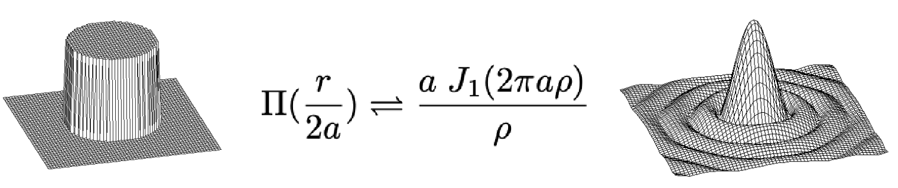
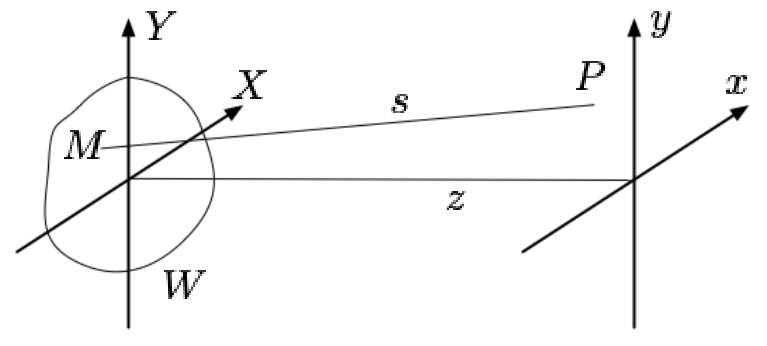
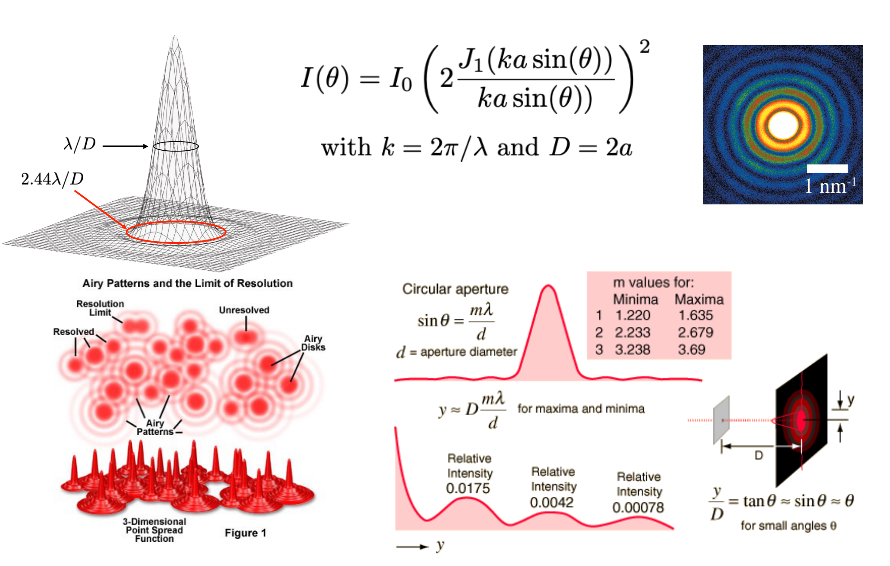
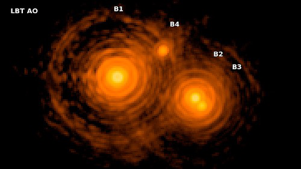
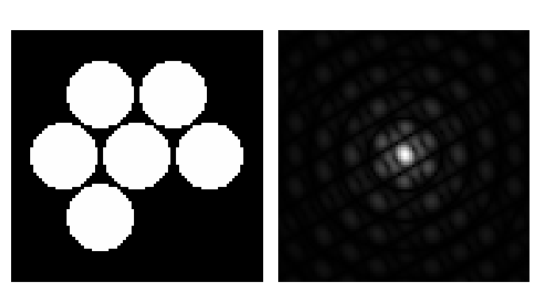
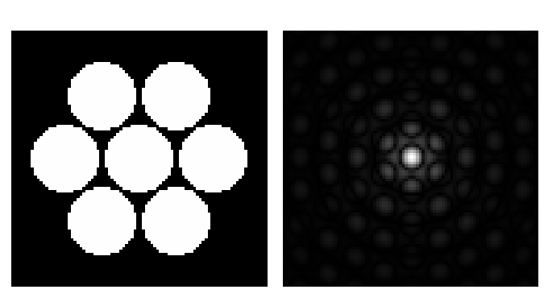
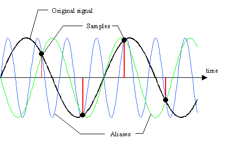
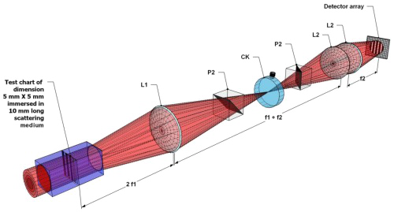
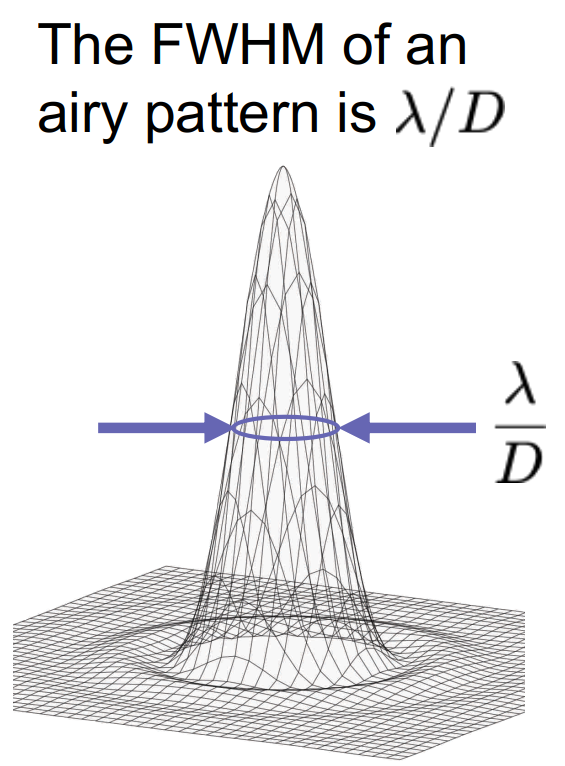

---
presentation:
 enableSpeakerNotes: true
 width: 960
 height: 700
 margin: 0.04
 controls: false
 theme: white.css
 progress: true
 slideNumber: 'c/t'
 keyboard: true
 center: false
 showNotes: false
 hash: false
 totalTime: 400
 overview: true
 transitionSpeed: 'default' # default/fast/slow
 mouseWheel: true
 transition: 'none' # none/fade/slide/convex/concave/zoom
title: "PHYS3057 Fourier Optics"
---

@import "anu.less"

<!-- slide -->
# Fourier Optics & Fourier Transform {ignore=true}

 
 
 
 
 
 
 
 
 

**Prof François Rigaut**
Research School of Astronomy & Astrophysics
The Australian National University

&copy; RIGAUT 2021, PHYS3057 FOURIER OPTICS

<!-- slide vertical=true -->

## Linear Optical Systems

&copy; RIGAUT 2021, PHYS3057 FOURIER OPTICS

<!-- slide -->

###### Preamble

<!-- slide vertical=true -->

## Introduction: Sources

* “**Introduction to Fourier Optics and coherence**”, J.-M.Mariotti, in Diffraction limited imaging with very large telescope, editors D.M.Alloin and J.-M. Mariotti, 1988 (JMM),
* “**Introduction to Fourier Optics**”, Joseph Goodman, 2004 (JG)
* “**Fundamental of Photonics**”, B.E.A Saleh & M.C.Teich, 1991, mostly Chapter 4 (S&T),
* “**Principles of Optics**”, Max Born and Emil Wolf, 1980 (B&W),
* “**Computational Fourier Optics: A MATLAB Tutorial**”, David Voelz
* The web, wikipedia.

&copy; RIGAUT 2021, PHYS3057 FOURIER OPTICS

<!-- slide vertical=true -->

## History of Fourier Optics

* 1660: First observation of diffraction by **Grimaldi**
* 1678: **Huygens** “Traité de la lumière” (published 1690): first wave theory of light. Require finite  speed of light.
* 1803: **Thomas Young** two slits interferences experiment.
* 1818: **Fresnel** produces the first theory of diffraction.
* 1822: **Fourier** introduces his transform
* 1850-1950: **Krichhoff**, **Sommerfeld**, then Quantum Mechanics bring a firm mathematical foundation to the theory.

* Of course **Newton** was involved too !

&copy; RIGAUT 2021, PHYS3057 FOURIER OPTICS

<!-- slide vertical=true -->

## Validity and limit conditions

* Previous lectures from PHYS3057 were **1D optics, coherent** (waveguides, lasers). The next lectures with me will be on **2D optics, incoherent sources** (imaging).

* We will consider **light as a scalar field** (B&W 8.4)

* We’ll be focusing (pun intended) on **Fraunhofer diffraction**

* **Diffraction occurs with all waves**, including sound, water, electromagnetic (X through radio), elementary particles.

* We’ll **browse through the maths**, it is there for reference and those who’d like to dig deeper

&copy; RIGAUT 2021, PHYS3057 FOURIER OPTICS

<!-- slide vertical=true -->

## Next two lectures in one slide

* Basic understanding of the **Fourier transform** and its properties, **sampling and aliasing** issues

* In Fourier Optics, light is described by a scalar field $\Psi = A \exp^{i\varphi}$

* In **Fraunhofer diffraction**, the **far and near field** complex amplitudes are linked by a Fourier transform $\Psi(P) = {\cal F}(\Psi(M))$

* An optical system can be characterised by its **impulse function** $H$. The impulse function is $H = |{\cal F}\left(\Psi(x)\right)|^2$

* Object $O$ and image ${\cal I}$ are linked by the relation ${\cal I} = O \ast H$

* The Optical Transfer Function of a system characterises its spatial frequencies filtering properties ${\rm OTF} = {\cal F}(H) = \Psi \ast \Psi^\star$

&copy; RIGAUT 2021, PHYS3057 FOURIER OPTICS

<!-- slide -->

###### Introduction to modal expansion

<!-- slide vertical=true -->

## Modal Expansion

 

$$\Huge f = \sum_i a_i \mu_i$$

where:
* $f$ is a discrete function/object
* $\mu_i$ are modes that you are going to use to represent
* $a_i$ are the coefficients

&copy; RIGAUT 2021, PHYS3057 FOURIER OPTICS

<!-- slide vertical=true -->

## Modal expansion

* The nature world is **continuous**
* Once measured, a **signal is discrete**.
  * Volt versus time
  * Elevation map
  * Image
* Chose the **modal basis** adapted to your problem.
* Goal is to try to **reduce the number of parameter** to describe function, and make use of convenient properties of this description
* Examples:
  * An optical phase using Zernike modes $\varphi = \sum_i a_i Z_i$
  * Finite Element Model analysis
  * Eigenvalues engenmodes
* Cyclic signals are naturally described by expanding on **sines and cosines**  $\rightarrow f = \sum_i a_i \cos(i\theta) + b_i \sin(i\theta)$

&copy; RIGAUT 2021, PHYS3057 FOURIER OPTICS

<!-- slide -->

###### The Fourier Transform

<!-- slide vertical=true -->

## What is the Fourier Transform?

* The Fourier transform of a signal tells you **what frequencies are present in your signal and in what proportions**

* IMHO, the **most useful mathematical tool for engineers and applied physicists**.
* It is used to:
  * **Characterise signals** (1D/2D..) and linear systems. Electronics, optics, acoustics, mechanics, civil engineering, etc, etc…
  * **Digitally process data/signals** (filtering, convolving, correlating, etc) in all above disciplines

&copy; RIGAUT 2021, PHYS3057 FOURIER OPTICS

<!-- slide vertical=true -->

## Fourier Filtering

&copy; RIGAUT 2021, PHYS3057 FOURIER OPTICS

<!-- slide vertical=true -->

## Fourier transform: definitions

* We note $\hat{f}$ the **Fourier transform** of $f$
$$\hat{f}(u) = \int_{-\infty}^{+\infty} f(x) \exp^{-i2\pi ux} dx$$
* The **inverse** Fourier transform is $f(x) = \int_{-\infty}^{+\infty} \hat{f}(u) \exp^{+i2\pi ux} du$
* We will also use the **Fourier operator** ${\cal F}$: $\hat{f}(u) = {\cal F}[f(x)]$
* The Fourier transform is **cyclic**: ${\cal F}^{-1}[{\cal F}[f(x)]] = f(x)$
* To have a Fourier transform, a function must
  * Be absolutely integrable $$ \left| \int_{-\infty}^{+\infty} f(x) dx \right| < \infty $$
  * Not have any infinite discontinuity
  * Have only a finite number of discontinuities or extrema in any finite interval

&copy; RIGAUT 2021, PHYS3057 FOURIER OPTICS

<!-- slide vertical=true -->

## Fourier Pairs

  
| Function | Fourier Pair |
|  --- | --- |
| $\exp(-\pi x^2)$ | $\exp(-\pi u^2)$ |
| ${\rm sinc}(x)$ | $\Pi(u)$ |
| ${\rm sinc}^2(x)$  | $\Lambda(u)$  |
| $\delta(x)$  | $1$   |
| ${\rm III}(x)$ | ${\rm III}(u)$ |
| $\sin(\pi x)$ | $\frac{i}{2} \delta (u+\frac{1}{2}) - \frac{i}{2} \delta (u-\frac{1}{2})$ |

&copy; RIGAUT 2021, PHYS3057 FOURIER OPTICS

<!-- slide vertical=true -->

## Properties

| Property | Expression |
| --- | --- |
| **Linearity** |  if $h(x) = a f(x) + b g(x)$ then $\hat{h}(u) = a \hat{f}(u) + b \hat{g}(u)$ |
| **Similarity** | ${\cal F}[f(ax)] = \frac{1}{ \lvert a \rvert } \hat{f} \left( \frac{u}{a} \right)$ |
| **Shift** | ${\cal F}[f(x-a)] = e^{-i2\pi a u} \hat{f}(u) $ |
| **Convolution** | ${\cal F}[f(x)\ast g(x)] = {\cal F}[f(x)] \times {\cal F}[g(x)] = \hat{f}(u) \times \hat{g}(u) $  |
| **Autocorrelation**  | ${\cal F}[f(x)\ast f(x)] = \lvert \hat{f}(u) \rvert^2 $ |
| **Parseval** | $\int_{-\infty}^{+\infty} f(x) \times g^\ast(x) dx = \int_{-\infty}^{+\infty} \hat{f}(u) \times \hat{g}^\ast(u) du $ |
| **Power** | $\int_{-\infty}^{+\infty} \lvert f(x) \rvert^2 dx = \int_{-\infty}^{+\infty} \lvert \hat{f}(u) \rvert^2 du $  |
| **Derivative** |  $ {\cal F}\left[ \frac{d}{dx} f(x) \right] = i2\pi u \hat{f}(u) $  |

&copy; RIGAUT 2021, PHYS3057 FOURIER OPTICS

<!-- slide -->

###### 2D FT, DFT, FFT, PSD

  
* Acronyms:
  * FT: Fourier Transform
  * DFT: Discrete FT
  * FFT: Fast FT
  * PSD: Power Spectral Density (modulus square)

<!-- slide vertical=true -->

## 2D Fourier transform

|  |  |
| --- | --- |
| **Forward** | $$\hat{f}(u,v) = \iint_{-\infty}^{+\infty} f(x,y) e^{-i2\pi (ux+vy)}  dx  dy$$ |
| **Reverse** | $$f(x,y) = \iint_{-\infty}^{+\infty} \hat{f}(u,v) e^{+i2\pi (ux+vy)}  du  dv   $$ |
| | |

* Note that if $f$ can be factorised (convenient) $f(x,y) = g(x).h(y)$ then $\hat{f}(u,x) = \hat{g}(u) \times \hat{h}(v)$
  * (but if $f(x,y) = g(r).h(\theta)$ the problem is more complicated ...)
* All other theorems apply as in 1D (linearity, similarity, power, etc)

&copy; RIGAUT 2021, PHYS3057 FOURIER OPTICS

<!-- 

 -->

<!-- slide vertical=true -->

## Some 2D Fourier pairs

&copy; RIGAUT 2021, PHYS3057 FOURIER OPTICS

<!-- slide vertical=true -->

## Discrete FT and Fast FT

* The Fourier transform can be modified for **discrete datasets**, which is extremely useful to represent and analyse **sampled physical signals**. The discrete Fourier transform (DFT) is:
$$\begin{aligned} \hat{f}(\nu) & = \frac{1}{N} \sum_{\tau=0}^{N-1} f(\tau) e^{-i2\pi\nu\tau/N} \\ f(\tau) & = \sum_{\nu=0}^{N-1} \hat{f}(\nu) e^{+i2\pi\nu\tau/N} \end{aligned}$$
* Both $\tau$ and $\nu$ are discrete variables. Both functions consist of sequences of N samples. All the basic theorems for the FT also apply to the DFT.
* The **Fast Fourier Transform (FFT)** is a DFT that uses a smart algorithm to drastically reduce the number of operations, from **$N^2$ down to $N \log(N)$**

&copy; RIGAUT 2021, PHYS3057 FOURIER OPTICS

<!-- slide vertical=true -->

## The Power Spectral Density (PSD)

* The square modulus of the Fourier transform of a signal
$${\rm PSD}(f) = |{\cal F}(f(x))|^2$$
* PSD is insensitive to the phase of the input signal.
  * you get the power (intensity) per frequency bin over the frequency range 0 to cut off frequency
* In a DFT, assuming:
  * the units of x are seconds (s),
  * and the units of f, say, Volts (V)
  * then the PSD units are V$^2$/Hz.

See Spectrum Density Analyser

&copy; RIGAUT 2021, PHYS3057 FOURIER OPTICS

<!-- slide -->

###### Diffraction Theory

<!-- slide vertical=true -->

## Huygens Principle

* “*Every point on a wavefront may be considered a source of secondary spherical wavelets which spread out in the forward direction at the speed of light. The new wavefront is the tangential surface to all of these secondary wavelets.*”

&copy; RIGAUT 2021, PHYS3057 FOURIER OPTICS

<!-- slide vertical=true -->

## (Non) Derivation of the diffracted field

|  |  |
| --- | --- |
| |  |

* Fresnel, KrichHoff and Sommerfeld, within others, have worked out the math. It's messy, and requires a lot of approximations.
* Applying the Huygens principle and working out the field propagation from the point $P_0$ through the aperture $W$ in plan $M$ (near field), to the final plan $P$ (far field), it can be demonstrated that the **field in $P$ is the simple Fourier Transform of the field in $M$**:

$$\huge \Psi (P) = {\cal F}(\Psi (M))$$

&copy; RIGAUT 2021, PHYS3057 FOURIER OPTICS

<!-- slide -->

###### Wavefront, PSF, OTF

<!-- slide vertical=true -->

## The Impulse Function

* Recalling the field in P: $\Psi(P) = {\cal F}(\Psi(M)) $
* At visible wavelengths, it is extremely difficult to measure the complex field itself (for quantum noise reasons) - but we can measure the field intensity (irradiance), the square of the complex field. H is the image of a point, the impulse function, also called the **Point Spread Function (PSF)**:

$$H = \Psi(P).\Psi^\ast(P) = {\cal F}(\Psi(M)).{\cal F}^\ast(\Psi(M)) = |{\cal F}(\Psi(M))|^2$$

Remember that $\Psi = A e^{i \varphi}$? So, in absence of aberrations ($\varphi\equiv0$), we simply have:
$$ H = | {\cal F}(A) |^2 $$

&copy; RIGAUT 2021, PHYS3057 FOURIER OPTICS

<!-- slide vertical=true -->

## The Impulse Function, circular aperture

For a circular aperture:
 $$ \Psi(M) = \Psi(r,\theta) = \Pi \left(\frac{r}{2a} \right) =  
\begin{cases}
1 &\text{if } r\le a \\\\
0 &\text{if }  r > a
\end{cases}$$

$$ H = | {\cal F}(\Psi(M))|^2 = | {\cal F}(\Psi(\Pi (r/2a)))|^2 = \left[ a \frac{J_1(2\pi a \rho)}{\rho} \right]^2$$

&copy; RIGAUT 2021, PHYS3057 FOURIER OPTICS

<!-- slide vertical=true -->

## An Application: Young Fringes

* Armed with this new mathematical description of diffraction, it is now trivial to find, e.g., the expression of the Young fringes.
* The slits can be described  as a convolution:

 
 
 

* The near field can be written $\small \Omega(x) = \Delta(x/a) \ast \Pi(x/d)$
* The far field is $\small \hat{\Omega}(u) = {\cal F}(\Delta(x/a) \ast \Pi(x/d)) = {\cal F}(\Delta(x/a)) \times {\cal F}(\Pi(x/d)) $
* $\small \Delta(x/a) = \delta(x-a)+\delta(x+a)$ hence
$\small {\cal F}(\Delta(x/a)) = e^{-i2\pi au}+e^{+i2\pi au} = 2 \cos(2\pi au)$
* and $\small {\cal F}(\Pi(x)) = {\rm sinc}(u)$ hence $\small {\cal F}(\Pi(x/d)) = {\rm sinc}(ud)$

Thus $\small \hat{\Omega}(u) = 2 \cos(2\pi au) \times {\rm sinc}(ud)$ and the intensity (measured)
$$|\hat{\Omega}(u)|^2 = 4 \cos^2(2\pi au) \times {\rm sinc}^2(ud) $$

&copy; RIGAUT 2021, PHYS3057 FOURIER OPTICS

<!-- slide vertical=true -->

## Airy pattern, circular aperture PSF

&copy; RIGAUT 2021, PHYS3057 FOURIER OPTICS

<!-- slide vertical=true -->

## The Optical Transfer Function

* Also called generically **Modulation Transfer Function (MTF)**
$${\rm OTF} = |{\cal F}(H)| = |\Psi \ast \Psi^*| $$
* Characterises the filtering properties of an optical system, including cut-off frequency
* For a circular aperture, the cut-off frequency is $f_c = D/\lambda$
* People have written books about it…

&copy; RIGAUT 2021, PHYS3057 FOURIER OPTICS

<!-- slide vertical=true -->

## Wavefront, PSF & OTF are linked

* The wavefront is $\Psi(x,y,t) = A(x,y,t) \exp( i \varphi(x,y,t))$
  * $\Psi$ is the complex field defined by its amplitude and phase
  * $A$ is the amplitude (e.g. pupil function)
  * $\varphi$ is the phase
* The Optical Transfer Function (or MTF) is the spatial frequency response of the system.
* **Wavefront, PSF and OTF are linked**:

&copy; RIGAUT 2021, PHYS3057 FOURIER OPTICS

<!-- slide -->

###### Interferometry to Imaging ...and Back

<!-- slide vertical=true -->

## Image formation for incoherent sources {style="font-size:1.3em;"}

* An object O can be decomposed into an infinite number of dirac function. In the case of an incoherent object (most objects in everyday’s life, astronomical objects, medicine,etc), these points **do not interfere**, thus the resulting image is the convolution of the object and the impulse response (PSF)
$$ \Large {\cal I} = O * H$$

Note that this assumes invariance of PSF with position in the field of view.

&copy; RIGAUT 2021, PHYS3057 FOURIER OPTICS

<!-- slide vertical=true -->

## Interferometry to Imaging...

* From "slit" to full aperture

Near field = Aperture = Pupil

Far field = Focal plane Image

Image cross section

&copy; RIGAUT 2021, PHYS3057 FOURIER OPTICS

<!-- slide vertical=true -->

## Interferometry to Imaging...

* From "slit" to full aperture

<!-- 
 -->
<video controls>
  <source src="assets/images/anim_1.mp4" type="video/mp4">
</video>
<!-- 
 -->

Near field = Aperture = Pupil

Far field = Focal plane Image

Image cross section

&copy; RIGAUT 2021, PHYS3057 FOURIER OPTICS

<!-- slide vertical=true -->

## ... and Imaging to Interferometry

&copy; RIGAUT 2021, PHYS3057 FOURIER OPTICS

<!-- slide vertical=true -->

## ... and Imaging to Interferometry

&copy; RIGAUT 2021, PHYS3057 FOURIER OPTICS

<!-- slide vertical=true -->

## ... and Imaging to Interferometry

&copy; RIGAUT 2021, PHYS3057 FOURIER OPTICS

<!-- slide vertical=true -->

## ... and Imaging to Interferometry

&copy; RIGAUT 2021, PHYS3057 FOURIER OPTICS

<!-- slide vertical=true -->

## ... and Imaging to Interferometry

&copy; RIGAUT 2021, PHYS3057 FOURIER OPTICS

<!-- slide vertical=true -->

## ... and Imaging to Interferometry

&copy; RIGAUT 2021, PHYS3057 FOURIER OPTICS

<!-- slide vertical=true -->

## ... and Imaging to Interferometry

&copy; RIGAUT 2021, PHYS3057 FOURIER OPTICS

<!-- slide -->

###### Elements of Sampling Theory

<!-- slide vertical=true class="quote-only" -->

## Sampling & Aliasing (Shannon/Nyquist)

> If a continuous, band-limited function $f(x)$ contains no frequency component higher than $f_c$, then it can be fully specified by a set of samples at frequency of $2\times f_c$ or larger.

&copy; RIGAUT 2021, PHYS3057 FOURIER OPTICS

<!-- slide vertical=true -->

## The Shah function ${\rm III}(x)$

1. ${\rm III}(x)$ is its own Fourier transform

2. The act of sampling is taking value at discrete points $\equiv$ Multiplication by ${\rm III}$

3. Convolution by ${\rm III}$ is equivalent to creating an infinite number of shifted replicas of the original functions

&copy; RIGAUT 2021, PHYS3057 FOURIER OPTICS

<!-- slide vertical=true -->

## Aliasing

Fourier view: In the DFT/FFT space, the function spectrum is replicated at intervals $2\times f_c$. If the spectrum spills over $\pm f_c$, then the spectrum replicas will overlap, resulting in a mixed signal (original lost).
 

&copy; RIGAUT 2021, PHYS3057 FOURIER OPTICS

<!-- slide vertical=true -->

## Aliasing

* Can 

 be spatial, temporal, angular, etc
* Can be solved/mitigated by pre-filtering the signal before sampling

&copy; RIGAUT 2021, PHYS3057 FOURIER OPTICS

<!-- slide vertical=true class="font80" -->

## proof of the sampling theorem

From $f(x)$ we obtain the sampled $f_s(x)$ with sampling interval $\tau$ by: $$f_s(x) = {\rm III}\left(\frac{x}{\tau}\right).f(x)$$ In the Fourier domain:
$$ \hat{f_s} (u) = \tau \; {\rm III}(\tau u) \ast \hat{f}(u) = \tau \sum_{-\infty}^{+\infty} \hat{f}\left( u - \frac{n}{\tau}\right)$$
The spectrum of the sampled function consists of an infinite sum of replicas of $\hat{f}(u)$. If $\tau^{-1} < 2 f_c$, the replicas are separated by distances larger than their width and do not overlap (if not, they do and it creates in aliasing). Hence the information on$\hat{f}(u)$and thus on$f(x)$is preserved if the sampling condition $\tau \le 1/(2 f_c)$ is met. We can retrieve the original spectrum by multiplying$\hat{f}(u)$by a rectangle function (gate) $\Pi(\tau u)$ in order to eliminate all replicas but one:
$$ \left[ \tau \; {\rm III}(\tau u) \ast \hat{f}(u) \right] \times \Pi(\tau u) = \hat{f}(u) $$
which yields by inverse Fourier transform
$$ \left[  {\rm III}(x/\tau).f(x) \right] \ast \tau^{-1} {\rm sinc}(x/\tau) = f_s(x) \ast \tau^{-1} {\rm III}(x/\tau) = f(x)$$

&copy; RIGAUT 2021, PHYS3057 FOURIER OPTICS

<!-- slide vertical=true -->

<video controls>
  <source src="assets/images/aliasing2.mp4" type="video/mp4" width="600px">
</video>

<!-- slide -->

## Main points of past two lectures

* Basic understanding of the **Fourier transform** and its properties, **sampling and aliasing** issues

* In Fourier Optics, light is described by a scalar field $\Psi = A \exp^{i\varphi}$

* In **Fraunhofer diffraction**, the **far and near field** complex amplitudes are linked by a Fourier transform $\Psi(P) = {\cal F}(\Psi(M))$

* An optical system can be characterised by its **impulse function** $H$. The impulse function is $H = |{\cal F}\left(\Psi(x)\right)|^2$

* Object $O$ and image ${\cal I}$ are linked by the relation ${\cal I} = O \ast H$

* The Optical Transfer Function of a system characterises its spatial frequencies filtering properties ${\rm OTF} = {\cal F}(H) = \Psi \ast \Psi^\star$

&copy; RIGAUT 2021, PHYS3057 FOURIER OPTICS

<!-- slide -->

###### Image Metrics, Aberations

<!-- slide vertical=true -->

## Practical Optical Systems

 

<!-- slide -->

## Image metric: Full-Width at Half-Maximum

* The width of the image at half its maximum. Often written FWHM
* For instance, a cross section of a gaussian image

* The FWHM is often naturally expressed as an angle (e.g. arcsec) or a distance (e.g. mm), as it often characterise a resolution

&copy; RIGAUT 2021, PHYS3057 FOURIER OPTICS

<!-- slide vertical=true -->

## Image metric: Strehl ratio ${\cal S}$

* The ratio between the maximum intensity in the actual image to the maximum in a diffraction limited image.

* A measure of how much energy is in the diffraction limited core
* For ${\cal S} \ge 0.2 \text{, } {\cal S} = \exp(-\sigma^2_\varphi)$
* $0 \le {\cal S} \le 1$. The Strehl ratio is often expressed in % ($0 < {\cal S} < 100$%)
$$ \sigma^2_\varphi = \frac{1}{S} \iint_S \left( \varphi(x,y) - \bar{\varphi}  \right)^2 ds  \text{ is the phase variance} $$

&copy; RIGAUT 2021, PHYS3057 FOURIER OPTICS

<!-- slide vertical=true -->

## Image metric: Encircled Energy

* Intensity within a certain radius normalised by total intensity of the image
$$\varepsilon(r) = \frac{ \int_{\theta=0}^{2\pi}\int_{\rho=0}^{r} {\cal I}(\rho,\theta) \rho \: d\rho \: d\theta }{ \int_{\theta=0}^{2\pi}\int_{\rho=0}^{\infty} {\cal I}(\rho,\theta) \rho \: d\rho \: d\theta} $$

&copy; RIGAUT 2021, PHYS3057 FOURIER OPTICS

<!-- slide vertical=true -->

## Beyond "Simple" Metrics

* High
&nbsp;&nbsp; HD8375. J.Crepp et al 2013
 contrast imaging required the development of new metrics and new techniques to improve contrast performance
* Speckle control (next page is one of them)

&nbsp;&nbsp; HR8799. T.Currie et al 2012

&copy; RIGAUT 2021, PHYS3057 FOURIER OPTICS

