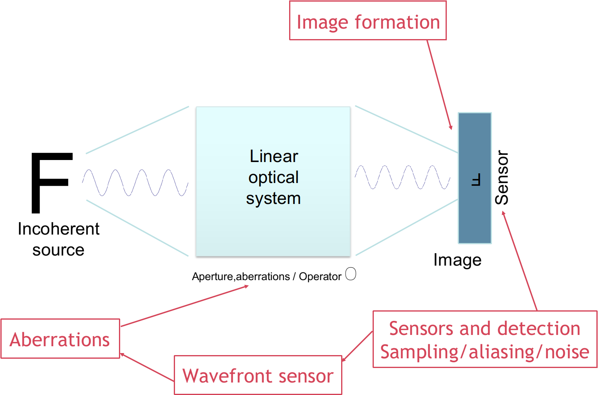

---
presentation:
 enableSpeakerNotes: true
 width: 960
 height: 700
 margin: 0.04
 controls: false
 theme: white.css
 progress: true
 slideNumber: 'c/t'
 keyboard: true
 center: false
 showNotes: false
 hash: false
 totalTime: 400
 overview: true
 transitionSpeed: 'default' # default/fast/slow
 mouseWheel: true
 transition: 'none' # none/fade/slide/convex/concave/zoom
title: "PHYS3057 Fourier Optics"
---

@import "anu.less"

<!-- slide -->
# Fourier Optics: Aberrations and Wavefront Sensors

  
 
 
 
 
 
 
 
 

**Prof François Rigaut**
Research School of Astronomy & Astrophysics
The Australian National University

&copy; RIGAUT 2021, PHYS3057 FOURIER OPTICS

<!-- slide vertical=true -->

###### Phase Aberrations

<!-- slide vertical=true -->

## Phase Aberrations - Geometrical view

* Wavefront departs from flatness
* When focused, rays do not intersect at the same location

&copy; RIGAUT 2021, PHYS3057 FOURIER OPTICS

<!-- slide vertical=true -->

## Phase Aberrations - Fourier Optics view

$$\Large \Psi(x,y,t) = A(x,y,t) e^{i{\color{red} \varphi(x,x,t)}}  $$

* Now $\varphi(x,y,t) \neq 0$, thus the PSF $H$ departs from the simple square modulus of the aperture, as presented in previous lectures.
* This yields asymmetry and spread, and a loss of angular resolution as well as:
  *  a loss of Strehl ratio
  * further attenuation of spatial frequencies in the OTF

&copy; RIGAUT 2021, PHYS3057 FOURIER OPTICS

<!-- slide -->

###### Seidel Aberrations

<!-- slide vertical=true -->

## Seidel Aberrations

* Primary aberrations from optical system misalignment or manufacturing error
* Seidel aberrations for monochromatic light:
  1) Spherical aberration
  1) Coma
  1) Astigmatism
  1) Curvature of field
  1) Distortion
  1) Chromatic

 (Not phase aberrations as described previously in this lecture, i.e. for a single point like object. Those are field dependent or wavelength dependant aberrations)

&copy; RIGAUT 2021, PHYS3057 FOURIER OPTICS

<!-- slide vertical=true -->

## Seidel aberrations: Coma

* Also a field aberration in many optical system (i.e. something you get when looking off-axis)
  * "field Aberration": an aberration that varies as a function of position in the output field (field = image plane)
* Characterised by core + tail  

&copy; RIGAUT 2021, PHYS3057 FOURIER OPTICS

<!-- slide vertical=true -->

## Seidel aberrations: Spherical

* Often due to polishing error
* The Hubble space telescope is an infamous example

&copy; RIGAUT 2021, PHYS3057 FOURIER OPTICS

<!-- slide vertical=true -->

## Seidel aberrations

* **Left**: geometrical (ray) view |  **right**: physical (Fourier) optics view

&copy; RIGAUT 2021, PHYS3057 FOURIER OPTICS

<!-- slide vertical=true -->

## Beyond Seidel: real eye cases

&copy; RIGAUT 2021, PHYS3057 FOURIER OPTICS

<!-- slide -->

###### Zernike polynomials to describe phase aberrations

<!-- slide vertical=true -->

## Zernike polynomials/modes

&copy; RIGAUT 2021, PHYS3057 FOURIER OPTICS

<!-- slide vertical=true -->

## Zernike polynomials: background

* The  mathematical functions were originally described by Fritz Zernike in 1934.
* They were developed to describe the diffracted wavefront in phase contrast imaging.
* Zernike won the 1953 Nobel Prize in Physics for developing Phase Contrast Microscopy.

&copy; RIGAUT 2021, PHYS3057 FOURIER OPTICS

<!-- slide vertical=true -->
## Zernike polynomials/modes

&copy; RIGAUT 2021, PHYS3057 FOURIER OPTICS

<!-- slide vertical=true -->
## Why Zernikes?

* Zernike polynomials have nice mathematical properties:
  * They are orthogonal over the continuous unit circle: $$\iint_S Z_i(x,y,)Z_j(x,y) dS = \delta_{ij}$$
  * All their derivatives are continuous.
* They efficiently represent common errors (e.g. coma, spherical aberration) seen in optics.
* They form a complete set, meaning that they can represent arbitrarily complex continuous surfaces given enough terms.

&copy; RIGAUT 2021, PHYS3057 FOURIER OPTICS

<!-- slide vertical=true -->
## Zernike polynomials

&copy; RIGAUT 2021, PHYS3057 FOURIER OPTICS

<!-- slide vertical=true -->
## Zernike polynomials...

&copy; RIGAUT 2021, PHYS3057 FOURIER OPTICS

<!-- slide vertical=true -->
## ... and corresponding PSFs

&copy; RIGAUT 2021, PHYS3057 FOURIER OPTICS

<!-- slide -->

###### Zernike polynomials to describe phase aberrations

<!-- slide vertical=true -->
## Phase expansion and phase variance

The phase can be described as a *superposition** (sum) of Zernike polynomials

$$ \varphi(x,y,t) \sum_{i=1}^\infty a_i(t) Z_i(x,y)  $$

where the coefficients are calculated as follow:

$$ a_i = \int_S W(r) \varphi(r,\theta) Z_i(r,\theta) \:r\:dr \:d\theta$$

The phase variance is then readily computed as:

$$ \sigma_\varphi^2 =<\varphi^2(x,y,t) >_t = \sum_{i=1}^\infty a^2_i(t) \text{ given } \iint_S Z_i(x,y,)Z_j(x,y) dS = \delta_{ij} $$

&copy; RIGAUT 2021, PHYS3057 FOURIER OPTICS

<!-- slide vertical=true -->
## Impact on Optical Transfer Function

&copy; RIGAUT 2021, PHYS3057 FOURIER OPTICS

<!-- slide vertical=true -->
## Aberration retrieval

* Using Wavefront sensors  
  * Hartmann, Shack-Hartmann sensor
  * Foucault knife, pyramid sensor
  * Interferometer: Michelson, Mach-Zehnder, Fizeau,…
  * Self referenced interferometers: Shearing, point diffraction,…
* Using the image itself
  * Phase diversity

&copy; RIGAUT 2021, PHYS3057 FOURIER OPTICS

<!-- slide -->

###### Wavefront Sensors

<!-- slide vertical=true -->

## Linear Optical Systems

&copy; RIGAUT 2021, PHYS3057 FOURIER OPTICS

<!-- slide vertical=true -->
## Wavefront Sensors (WFS)

* A device that is measuring the wavefront phase (and potentially amplitude)
* Many wavefront sensors measure the phase first derivative (local slope) or second derivative (local curvature), some use a mix of both
  * First derivative wavefront sensors:
    * Shack-Hartmann
    * Shearing interferometers (lateral, radial, rotation)
    * Pyramid, Foucault knife
* Second derivative wavefront sensors:
  * Curvature
* And then some device measure the phase difference with some reference wave:
  * Point diffraction interferometer, Michelson, …
* But all do that through an intensity measurement of some sort 

$$ \Bigg) \frac{\partial\varphi}{\partial x} or \nabla\varphi$$ 
$$ \Big) \frac{\partial\varphi}{\partial x} or \nabla\varphi$$ 
$$ \big) \varphi$$ 

&copy; RIGAUT 2021, PHYS3057 FOURIER OPTICS

<!-- slide -->

###### Shack-Hartmann Wavefront Sensor: how does it work?

<!-- slide vertical=true -->
## Shack-Hartmann WFS

&copy; RIGAUT 2021, PHYS3057 FOURIER OPTICS

<!-- slide vertical=true -->
## Shack-Hartmann WFS

&copy; RIGAUT 2021, PHYS3057 FOURIER OPTICS

<!-- slide vertical=true -->
## Shack-Hartmann WFS

&copy; RIGAUT 2021, PHYS3057 FOURIER OPTICS

<!-- slide vertical=true -->
## Shack-Hartmann WFS

&copy; RIGAUT 2021, PHYS3057 FOURIER OPTICS

<!-- slide vertical=true -->
## Shack-Hartmann WFS

&copy; RIGAUT 2021, PHYS3057 FOURIER OPTICS

<!-- slide vertical=true -->
## Shack-Hartmann WFS

&copy; RIGAUT 2021, PHYS3057 FOURIER OPTICS

<!-- slide -->

###### SHWFS Extension in two dimensions

<!-- slide vertical=true -->
## Shack-Hartmann in 2D

* A Shack-Hartmann sensor measure the average X and Y gradient over the subaperture

&copy; RIGAUT 2021, PHYS3057 FOURIER OPTICS

<!-- slide vertical=true -->
## Shack-Hartmann in 2D

 

No Aberration

&copy; RIGAUT 2021, PHYS3057 FOURIER OPTICS

<!-- slide vertical=true -->
## Shack-Hartmann in 2D

 

Tilt (Z2)

&copy; RIGAUT 2021, PHYS3057 FOURIER OPTICS

<!-- slide vertical=true -->
## Shack-Hartmann in 2D

 

Defocus (Z4)

&copy; RIGAUT 2021, PHYS3057 FOURIER OPTICS

<!-- slide vertical=true -->
## Shack-Hartmann in 2D

 

Astigmatism (Z6)

&copy; RIGAUT 2021, PHYS3057 FOURIER OPTICS

<!-- slide vertical=true -->
## Shack-Hartmann in 2D

 

Coma (Z8)

&copy; RIGAUT 2021, PHYS3057 FOURIER OPTICS

<!-- slide vertical=true -->
## Shack-Hartmann in 2D

 

Spherical (Z11)

&copy; RIGAUT 2021, PHYS3057 FOURIER OPTICS

<!-- slide vertical=true -->
## Shack-Hartmann in 2D

 

High order (e.g. Z21)

&copy; RIGAUT 2021, PHYS3057 FOURIER OPTICS

<!-- slide -->

###### Real-World Considerations

<!-- slide vertical=true -->
## What WFS to choose?

* Noise, usage of light
* Dynamical range
* Linearity, hysteresis
* Cost
* Polychromaticity
* Spatial aliasing
* Speed, computational requirements
* Solution uniqueness
* Extended sources
* Self referenced
* Ease of implementation

&copy; RIGAUT 2021, PHYS3057 FOURIER OPTICS

<!-- slide vertical=true -->
## Sensor Transfer function

&copy; RIGAUT 2021, PHYS3057 FOURIER OPTICS

<!-- slide vertical=true -->
## Sensing issues: non linearity

&copy; RIGAUT 2021, PHYS3057 FOURIER OPTICS

<!-- slide vertical=true -->
## Sensing issues: Calibration error

&copy; RIGAUT 2021, PHYS3057 FOURIER OPTICS

<!-- slide vertical=true -->
## Sensing issue: Hysteresis

&copy; RIGAUT 2021, PHYS3057 FOURIER OPTICS

<!-- slide vertical=true -->
## Noise and SNR

&copy; RIGAUT 2021, PHYS3057 FOURIER OPTICS

<!-- slide vertical=true -->
## Trade-offs and choice drivers

&copy; RIGAUT 2021, PHYS3057 FOURIER OPTICS

<!-- slide -->

###### Other Real-World Considerations

<!-- slide vertical=true -->
## Practical implementation

In Astronomy  In Ophthalmology

* Field stop
* Collimating optics (usually lenslet 1F behind collimator)
* Lenslet array (most commercial arrays have pitch of 100-1000 μm)
* 2D Sensor: Most CCDs/CMOS have pixels of 2 (CMOS for phones) to 20 microns (CCDs for science applications). Typical format 128^2^ to 2048^2^.

&copy; RIGAUT 2021, PHYS3057 FOURIER OPTICS

<!-- slide vertical=true -->
## Applications & Needs

&copy; RIGAUT 2021, PHYS3057 FOURIER OPTICS

<!-- slide -->

###### Alternatives WFS techniques

<!-- slide vertical=true -->
## Alternative: Phase diversity

* Focal  plane method
* Acquire an “in focus” image
* but (wavefront) phase is lost during the image formation
$$ {\cal I} = | {\cal F} (A e^{i\varphi}) |^2 $$
* ...and an image with some added phase “diversity”, e.g. focus
$$ {\cal I}' = | {\cal F} (A e^{i(\varphi+\varphi_0)}) |^2 $$
* The second image lift the sign uncertainty
* Then use a minimisation package (Steepest descent, Conjugate Gradient, Levenberg–Marquardt, etc) to find the phase that reproduce best the images, or AI.

&copy; RIGAUT 2021, PHYS3057 FOURIER OPTICS

<!-- slide vertical=true -->
## Minimisation & Fitting

* The problem:  Given data points $y_i$ at $x_i$, find model parameters $\beta$ so that the least square distance model-data $S$ is minimum:
$$ S(\beta_1,\beta_2) = \sum_{i=1}^m (y_i - f(x_i,\beta_1,\beta_2))^2$$
* Iterative methods
* Steepest descent, Conjugate Gradient, 
Levenberg–Marquardt
* Issue with local minima:

&copy; RIGAUT 2021, PHYS3057 FOURIER OPTICS

