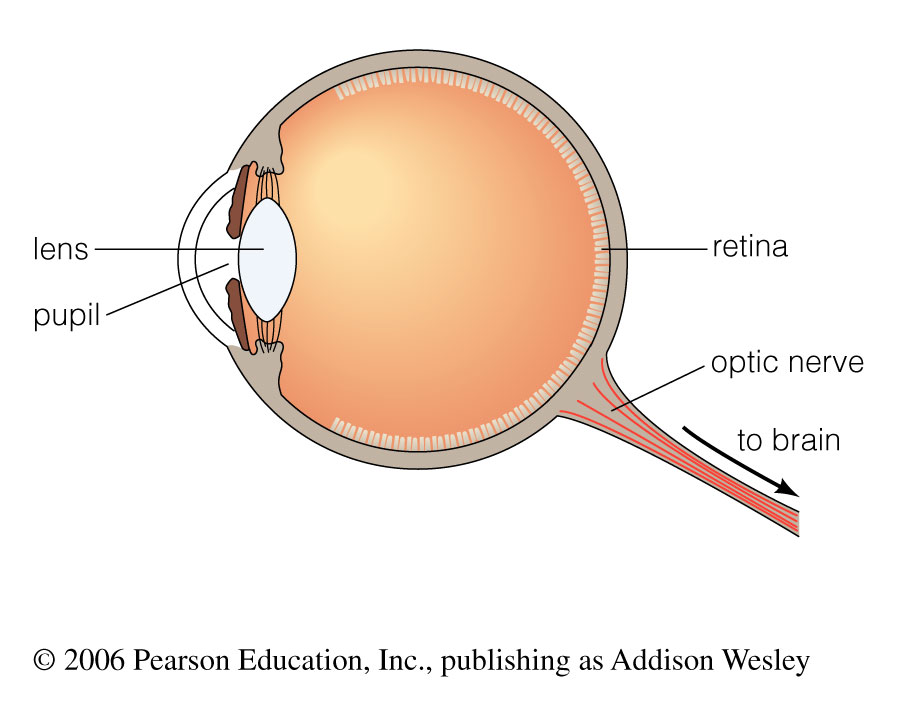

<!-- _class: invert -->
# <!-- fit -->Introduction to Telescope Imaging

Based on chapter 5, Pearson education, Astronomy today, Chaisson/McMillan. Used with authorisation.

**Prof François Rigaut**
Research School of Astronomy & Astrophysics
The Australian National University

---

## Goals for Learning

- How are cameras similar to eyes?
- What is angular resolution?
- What are refracting and reflecting telescopes?
- Why put telescopes in space?

---

## Measuring Light

- The light from other worlds contains vast amounts of information about those worlds. 
- Why can’t we just use our eyes to study this light?

---

## Eyes?

- Visible only
- Eyes can’t make records of what they see
- Can’t see dim light, blinded by bright light
- Different eyes have different properties

- But eyes are a good prototype for understanding cameras and telescopes

---
## The Eye
- Pupil - Control how much light comes in
- Lens -  Brings the light together where it can be measured
- Retina – Measures the light, sends results to computer

---
## Image Positioning Cheat Sheet

``
``
`
`

