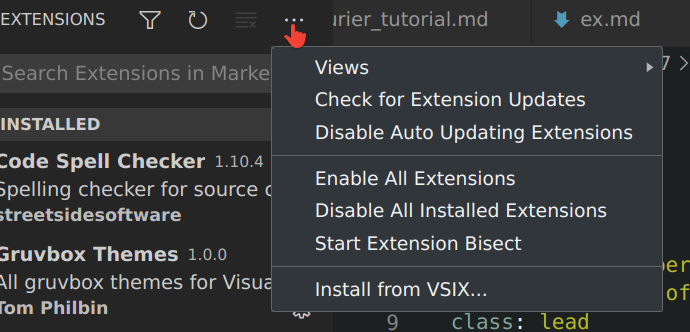
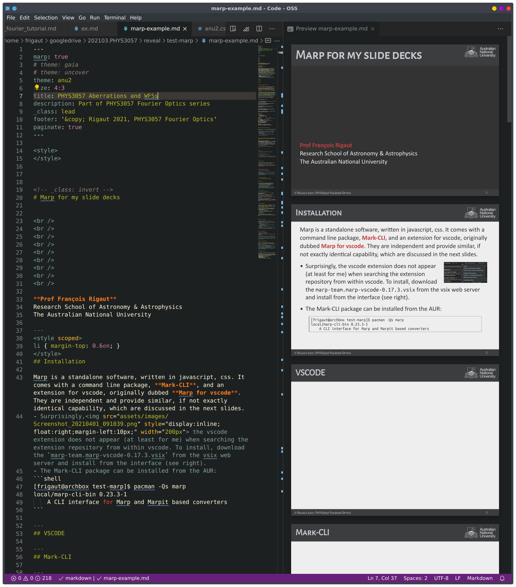
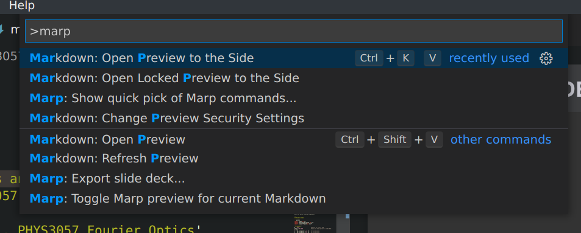
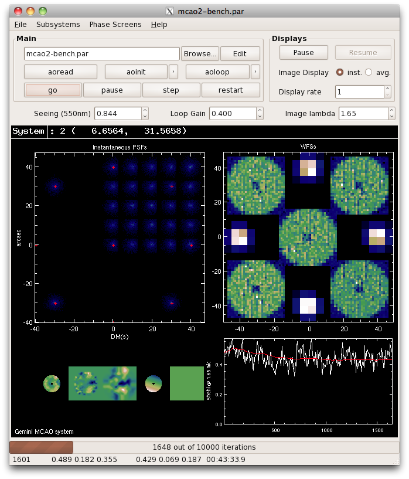

<style>
</style>


<!-- _class: invert -->
# Marp for my slide decks


<div class="authors">

**Prof François Rigaut**
Research School of Astronomy & Astrophysics
The Australian National University
</div>

---
<style scoped>li { margin-top: 0.6em; }</style>
## Installation

Marp is a standalone software, written in javascript, css. It comes with a command line package, **Mark-CLI**, and an extension for vscode, originally dubbed **Marp for vscode**. They are independent and provide similar, if not exactly identical capability, which are discussed in the next slides.
- Surprisingly, the vscode extension does not appear (at least for me) when searching the extension repository from within vscode. To install, download the `marp-team.marp-vscode-0.17.3.vsix` from the vsix web server and install from the interface (see right).
- The Mark-CLI package can be installed from the AUR:
```shell
[frigaut@archbox test-marp]$ pacman -Qs marp
local/marp-cli-bin 0.23.3-1
    A CLI interface for Marp and Marpit based converters
```

---
## Resources

<div style="font-size: 150%;">

Lots of them. It's a bit of a mess actually, as they are transitioning to a new marp.
- [Main Marp page](https://marp.app/)
- [Marp for vscode](https://marketplace.visualstudio.com/items?itemName=marp-team.marp-vscode)
- [marp-cli](https://github.com/marp-team/marp-cli)

For developpers:
- [marp-core](https://github.com/marp-team/marp-core)
- [marpit](https://marpit.marp.app/)
</div>


---
<style scoped>
p { margin-top: 0.6em; }
</style>
## VSCODE

<div style="font-size: 110%;">


As for other vscode or atom package, what they do is translate the markdown to html, using javascript. There is a local server that display the resulting HTML (see right). 

There is also an export feature, accessible from the menu:


</div>

---
## Mark-CLI

`marp` is a command line utility. Its function is essentially to process the markdown, generate the slides, and export in various formats: html, pdf, pptx, png, etc. The most useful commands are:

- Generate a html from the md file (for a pdf just add `--pdf`)
```shell
marp --allow-local-files --theme-set assets/css/ --html marp-example.md
```
(note that I have all css in `assets/css`)
- Start a server , browse the md files and generate the slides:
```shell
marp --html --allow-local-files --bespoke.progress --server .
```
You can connect to this server using `http://localhost:8080/`.
The server monitors changes to the md files and refresh the html instantly when that happens.


---
## CSS & Markdown

I have tuned anu.css, a css file to mimic the style I have perfected along the years, used in this very slide deck.

The Markdown looks like this:

```markdown
---
YAML
---
A new slide is as follow:
---
## CSS & Markdown

I have tuned anu.css, a css file to mimic the style I have perfected 
along the years, used in this very slide deck.

The Markdown looks like this:
etc etc
```
- `---` is a separator between slides
- All regular MD applies.

This slide deck (`marp-example.md`) can be taken as a start for new presentations. Illustration of image positioning, equations, etc follows.

---
## Front Matter

The current file YAML looks like this:

```YAML
---
marp: true # basic, otherwise marp doesn't interpret
theme: anu # my theme. anu.css in this directory
size: 4:3  # 4:3 slide - gotta love it
title: PHYS3057 Aberrations and WFSs
description: Part of PHYS3057 Fourier Optics series
_class: lead
footer: '&copy; Rigaut 2021, PHYS3057 Fourier Optics' # will be displayed in footer.
paginate: true
---
```

There is a number of subtleties for the CSS. In vscode, every cs file has to be declared in the settings. For marp-cli, at the command line. Also, remember that marpit theme css requires `/* @theme meta */`. The same applies for the syntax highlighting css file (which I include in the main anu.css). Last, if changing the syntax css, the background in this file has to be manually copied into the `pre, code and pre code` css background values.

---
## Positioning images, Best solution

The `</span>` plays well even with other MD code, like lists:

- For an easy (**here**) <span style="display:inline; float:right; margin:0; margin-left:10px; "></span>positioning, non-absolute, `there are essentially` three possibilities: `float:right`, `float:left` and `inline-block`. For instance, the yao gui is `float:right` and is inserted in the text where it says above. 

- Then we have a left positioned float, as in **here**.<span style="display:inline; float:left; margin:0; margin-right:15px;"></span> And finally, we have the _inline-block_, as this mavis logo image <span style="display:inline-block;"></span> which is displayed really within the text flowing with it. Lorem ipsum dolor sit amet, consectetur adipiscing elit. 

This also works outside of bullets (normal paragraphs).

---
## Positioning images, Summary


1. To simply include an image to position here, with clear:both;
``
2. For a left float image:
```

```
3. For an inline image:
```

```
4. For a right float image:
```

```

(Also, no `<cr>` before that or else it's a `clear`. And the width is better stated in pixels.)

---
## Example Code
This is _pre code_ CSS python code:

```python
import numpy as np
import matplotlib.pyplot as plt
import scipy.fftpack as sciF

"Parameters"
N = 1024                   #amount of pixels NxN
radii = 0.0625             #radii of the aperture: 2*64/1024 = 0.0625
x = np.linspace(-1,1, N)   #x-coordinates
y = np.linspace(-1,1, N)   #y-coordinates
X,Y = np.meshgrid(x,y)     #Coordinates for plotting
aper = ((X**2+Y**2) < radii**2)
Psi_fft   = sciF.fft2(aper)
Psi_shift = sciF.fftshift(Psi_fft)
H = np.abs(Psi_shift)**2

"Plots"
plt.figure(1); plt.imshow(aper); plt.show()
plt.figure(2); plt.imshow(np.sqrt(H)); plt.show()

```


---

## YAO GUI


* the **YAO GUI** is great!


* It is written in GTK
  * The above image is inline. I'm looking for a way to easily code float left or right (Found! see <a href="#4">slide 4</a>)


---
## Phase expansion and phase variance


The phase can be described as a *superposition* (sum) of Zernike polynomials

$$ \varphi(x,y,t) \sum_{i=1}^\infty a_i(t) Z_i(x,y)  $$

where the coefficients are calculated as follow:

$$ a_i = \int_S W(r) \varphi(r,\theta) Z_i(r,\theta) \:r\:dr \:d\theta$$

The phase variance is then readily computed as:

$$ \sigma_\varphi^2 =<\varphi^2(x,y,t) >_t = \sum_{i=1}^\infty a^2_i(t) \text{ given } \iint_S Z_i(x,y,)Z_j(x,y) dS = \delta_{ij} $$


