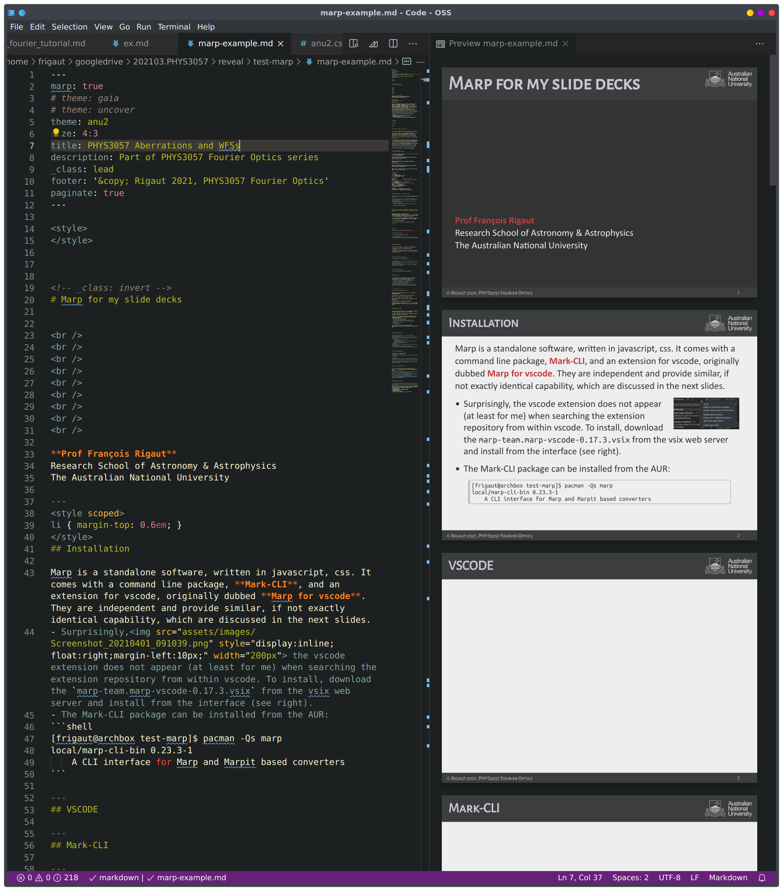
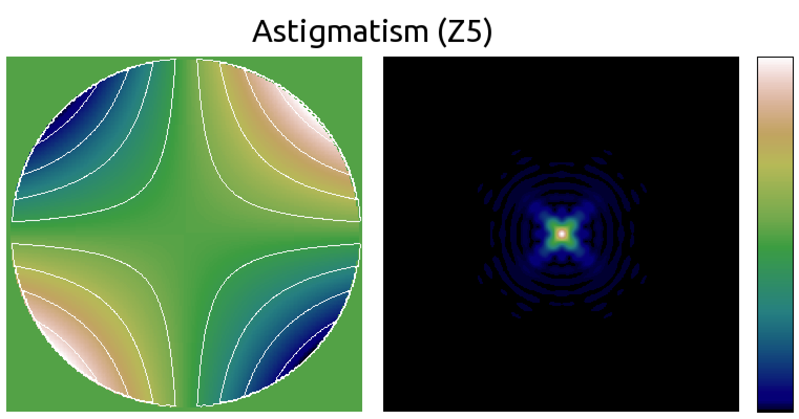
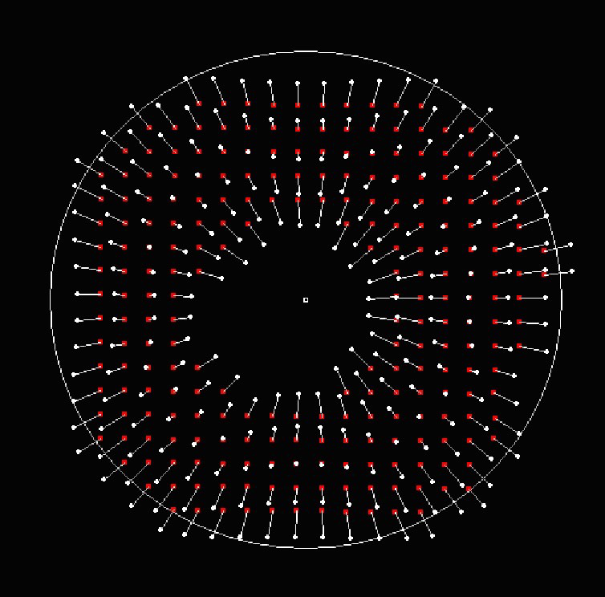
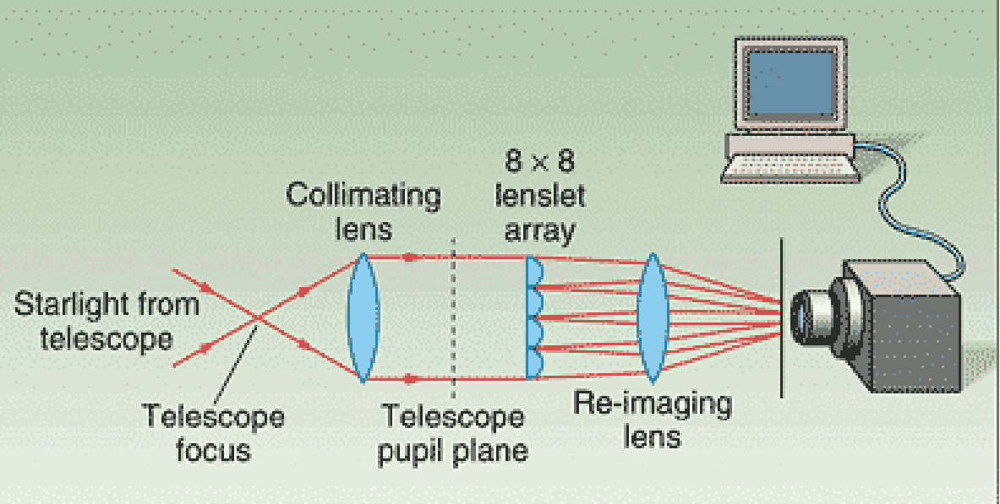

<style>
</style>


<!-- _class: invert -->
# Marp for my slide decks


<br /> 
<br />
<br />
<br />
<br />
<br />
<br />
<br />
<br />

**Prof François Rigaut**
Research School of Astronomy & Astrophysics
The Australian National University

---
<style scoped>
li { margin-top: 0.6em; }
</style>
## Installation

Marp is a standalone software, written in javascript, css. It comes with a command line package, **Mark-CLI**, and an extension for vscode, originally dubbed **Marp for vscode**. They are independent and provide similar, if not exactly identical capability, which are discussed in the next slides.
- Surprisingly, the vscode extension does not appear (at least for me) when searching the extension repository from within vscode. To install, download the `marp-team.marp-vscode-0.17.3.vsix` from the vsix web server and install from the interface (see right).
- The Mark-CLI package can be installed from the AUR:
```shell
[frigaut@archbox test-marp]$ pacman -Qs marp
local/marp-cli-bin 0.23.3-1
    A CLI interface for Marp and Marpit based converters
```

---
<style scoped>
p { margin-top: 0.6em; }
</style>
## VSCODE


As for other vscode or atom package, what they do is translate the markdown to html, using javascript. There is a local server that display the resulting HTML (see right). 

There is also an export feature, accessible from the menu:


---
## Mark-CLI

`marp` is a command line utility. Its function is essentially to process the markdown, generate the slides, and export in various formats: html, pdf, pptx, png, etc. The most useful commands are:

- Generate a html from the md file:
```shell
marp marp-example.md --theme anu2.css --html --allow-local-files
```
- For a pdf, just add `--pdf`:
```shell
marp marp-example.md --theme anu2.css --html --allow-local-files --pdf
```

- Start a server from which you can browse the md files and generate the slides:
```shell
marp --html --allow-local-files --bespoke.progress --server .
```
You can connect to this server using `http://localhost:8080/`.
The server monitors changes to the md files and refresh the html instantly when that happens.


---
## CSS


---
## Positioning images, Best solution


The `</span>` plays well even with other MD code, like lists:

- For an easy (**here**) <span style="display:inline; float:right; margin:0; margin-left:10px; "></span>positioning, non-absolute, `there are essentially` three possibilities: _float right_, _float left_ and _inline block_. For instance, the yao gui is _float right_ and is inserted in the text where it says above. 

- Then we have a left positioned float, as in **here**.<span style="display:inline; float:left; margin:0; margin-right:15px;"></span> And finally, we have the _inline-block_, as this mavis logo image <span style="display:inline-block;"></span> which is displayed really within the text flowing with it. Lorem ipsum dolor sit amet, consectetur adipiscing elit, sed do eiusmod tempor incididunt ut labore et dolore magna aliqua. 

This also works outside of bullets (normal paragraphs).

---
<!-- _class: invert -->
## Positioning images, Summary


1. To simply include an image to position here, with clear:both;
``
2. For a left float image:
```

```
3. For an inline image:
```

```
4. For a right float image:
```

```

(Also, no `<cr>` before that or else it's a `clear`. And the width is better stated in pixels.)

---
## Example Code

```python
import numpy as np
import matplotlib.pyplot as plt
import scipy.fftpack as sciF

"Parameters"
N = 1024                   #amount of pixels NxN
radii = 0.0625             #radii of the aperture: 2*64/1024 = 0.0625 
x = np.linspace(-1,1, N)   #x-coordinates
y = np.linspace(-1,1, N)   #y-coordinates
X,Y = np.meshgrid(x,y)     #Coordinates for plotting
aper = ((X**2+Y**2) < radii**2)
Psi_fft   = sciF.fft2(aper)
Psi_shift = sciF.fftshift(Psi_fft)
H = np.abs(Psi_shift)**2

"Plots"
plt.figure(1); plt.imshow(aper); plt.show()
plt.figure(2); plt.imshow(np.sqrt(H)); plt.show()

```

---
## Phase Aberrations - Fourier Optics view


$$\large \Psi(x,y,t) = A(x,y,t) e^{i{\color{red} \varphi(x,x,t)}}  $$

- Now, $\varphi(x,y,t) \neq 0$, thus the PSF $H$ departs from the simple square modulus of the aperture, as presented in previous lectures.
- This yields asymmetry and spread, and a loss of angular resolution as well as:
  -  a loss of Strehl ratio
  - further attenuation of spatial frequencies in the OTF


---

## <!--fit--> Auto scaling of equations, code snippet, and all the thingies<br> that you could think of (including this slide title).


Auto scaling of math (on top of css file)
$$ \sigma_\varphi^2 = <\varphi^2(x,y,t) >_t = \sum_{i=1}^\infty a^2_i(t) \text{ given } \iint_S Z_i(x,y,)Z_j(x,y) dS = \delta_{ij} =  \sigma_\varphi^2 = <\varphi^2(x,y,t) >_t $$

... seems to work (a bit cramped, but on purpose). It can also be set for code, but I decided against it. A blurred image:

<div style="filter:invert(1);">


</div>


---

## YAO GUI


* the **YAO GUI** is great!


* It is written in GTK
  * The above image is inline. I'm looking for a way to easily code float left or right (Found! see <a href="#4">slide 4</a>)


---

## Seidel aberrations


On this slide the images are arranged in a markdown table:

| Geometrical (ray) view |  Fourier optics view |
| --- | --- |
|  |  |


---

## Zernike polynomials: background


- The mathematical functions were originally described by Fritz Zernike in 1934.
- They were developed to describe the diffracted wavefront in phase contrast imaging.
- Zernike won the 1953 Nobel Prize in Physics for developing Phase Contrast Microscopy.


---
## Zernike polynomials/modes


---
## Why Zernikes?


- Zernike polynomials have nice mathematical properties:
  - They are orthogonal over the continuous unit circle: $\iint_S Z_i(x,y,)Z_j(x,y) dS = \delta_{ij}$
  - All their derivatives are continuous.
- They efficiently represent common errors (e.g. coma, spherical aberration) seen in optics.
- They form a complete set, meaning that they can represent arbitrarily complex continuous surfaces given enough terms.


---
<!-- _class: invert -->

## Phase expansion and phase variance


The phase can be described as a *superposition* (sum) of Zernike polynomials

$$ \varphi(x,y,t) \sum_{i=1}^\infty a_i(t) Z_i(x,y)  $$

where the coefficients are calculated as follow:

$$ a_i = \int_S W(r) \varphi(r,\theta) Z_i(r,\theta) \:r\:dr \:d\theta$$

The phase variance is then readily computed as:

$$ \sigma_\varphi^2 =<\varphi^2(x,y,t) >_t = \sum_{i=1}^\infty a^2_i(t) \text{ given } \iint_S Z_i(x,y,)Z_j(x,y) dS = \delta_{ij} $$


---
## Aberration retrieval




- Using Wavefront sensors
  - Hartmann, Shack-Hartmann sensor
  - Foucault knife, pyramid sensor
  - Interferometer: Michelson, Mach-Zehnder, Fizeau,…
  - Self referenced interferometers: Shearing, point diffraction,…
- Using the image itself
  - Phase diversity


---
## Wavefront Sensors (WFS)


- A device that is measuring the wavefront phase (and potentially amplitude)
- Many wavefront sensors measure the phase first derivative (local slope) or second derivative (local curvature), some use a mix of both
  - First derivative wavefront sensors:
    - Shack-Hartmann
    - Shearing interferometers (lateral, radial, rotation)
    - Pyramid, Foucault knife
- Second derivative wavefront sensors:
  - Curvature
- And then some device measure the phase difference with some reference wave:
  - Point diffraction interferometer, Michelson, …
- But all do that through an intensity measurement of some sort 


---

## Practical implementation


|In Astronomy  |In Ophthalmology |
|--- |--- |
|  |  |

- Field stop
- Collimating optics (usually lenslet 1F behind collimator)
- Lenslet array (most commercial arrays have pitch of 100-1000 μm)
- 2D Sensor: Most CCDs/CMOS have pixels of 2 (CMOS for phones) to 20 microns (CCDs for science applications). Typical format $128^2$ to $2048^2$.


---
## Alternative: Phase diversity


- Focal plane method
- Acquire an "in focus" image
- but (wavefront) phase is lost during the image formation ${\cal I} = | {\cal F} (A e^{i\varphi}) |^2$
- ...and an image with some added phase "diversity", e.g. focus ${\cal I}' = | {\cal F} (A e^{i(\varphi+\varphi_0)}) |^2$
- The second image lift the sign uncertainty
- Then use a minimisation package (Steepest descent, Conjugate Gradient, Levenberg–Marquardt, etc) to find the phase that reproduce best the images, or AI.


---
## Minimisation & Fitting


- The problem:  Given data points $y_i$ at $x_i$, find model parameters $\beta$ so that the least square distance model-data $S$ is minimum:
$S(\beta_1,\beta_2) = \sum_{i=1}^m (y_i - f(x_i,\beta_1,\beta_2))^2$
- Iterative methods
- Steepest descent, Conjugate Gradient, 
Levenberg–Marquardt
- Issue with local minima:


