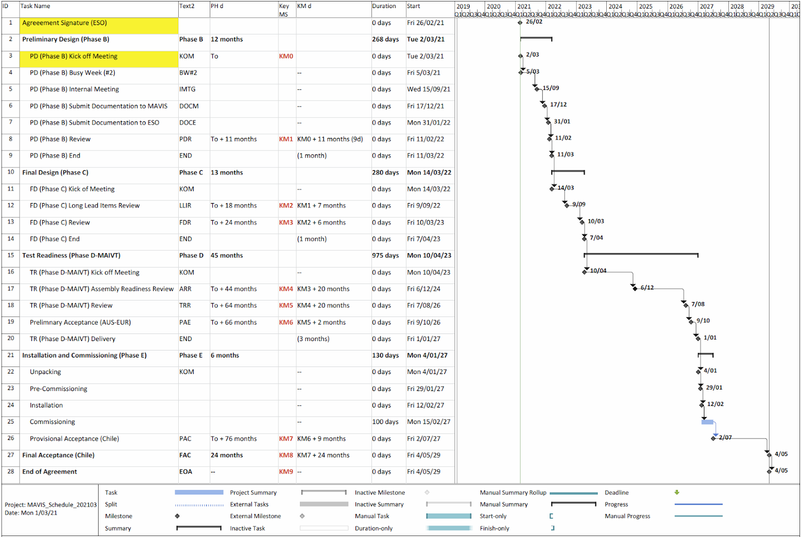

# Busy week 03/2021 Project Summary

Francois, Gaston, David, others
MAVIS project office

---

## Status of agreement with ESO

- Agreement finalised (really)!
  - Available on MAVIS disk, at WP1 > ESO document - Phase B > Agreement
  - PMs please review one more time
  - Previous version already circulated, including to Steering Committee.
- RAR requested for update/final SoW
- TRS: Hopefully final version by April 2 - ESO still has not committed firmly to this date
- Agreement signature: need some time to process SoW+TRS, so signature ~ document delivery + 1-2 weeks.
- KoM following that. Need to stay flexible on this - probably fine as only ½ day meeting.

---

## Status of agreement with ESO

- GTO night policy: Further progress made between PI+PSs.
- TLR: 4 TLR still being (re)formulated, close.
- Consortium agreement: 
  - ESO happy with our MoU as far as MAVIS agreement is concerned.
  - But, we still need to converge on the consortium agreement as fast as possible. 
  - Got my hand on the MUSE agreement, drafting a MAVIS agreement from there.
  - Will include:
    - Governance
    - GTO night and publication policy
    - How we handle disagreements
    - The contribution of each partners (FTE etc)
- Progress on Australian funding (LIEF grant led by Richard). Good support by many Oz institutes.

---
## MISC/other PI stuff

- New staff since phase A review: Capodimonte (electronics AOM), Rosanna Sordo, Alfio Puglisi, Fabio Rossi, Mirko Colapietro, Scott Smedley + others. Welcome to all!
- COVID:
  - Significant impact on progress since Phase A review
  - Inability to meet face to face + time difference has had a huge impact too on our overall output
  - Australia still close for a likely 6 months (Qantas plans to resume flight in October)
- Nevertheless the last 6 months have seen progress on:
  - AO simulations, including work on flux by Pierre + Guido
  - RTC
  - Overall budget
  - TRS
  - PA
  - Schedule
  - etc

---
## MAVIS Schedule

---

## VSCODE

As for other vscode or atom package, what they do is translate the markdown to html, using javascript. There is a local server that display the resulting HTML (see right). 

There is also an export feature, accessible from the menu:

